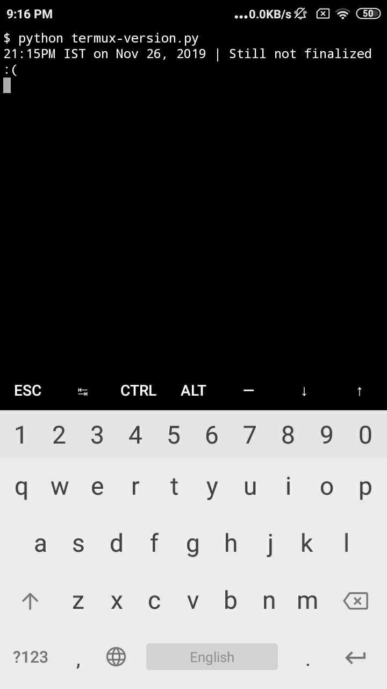
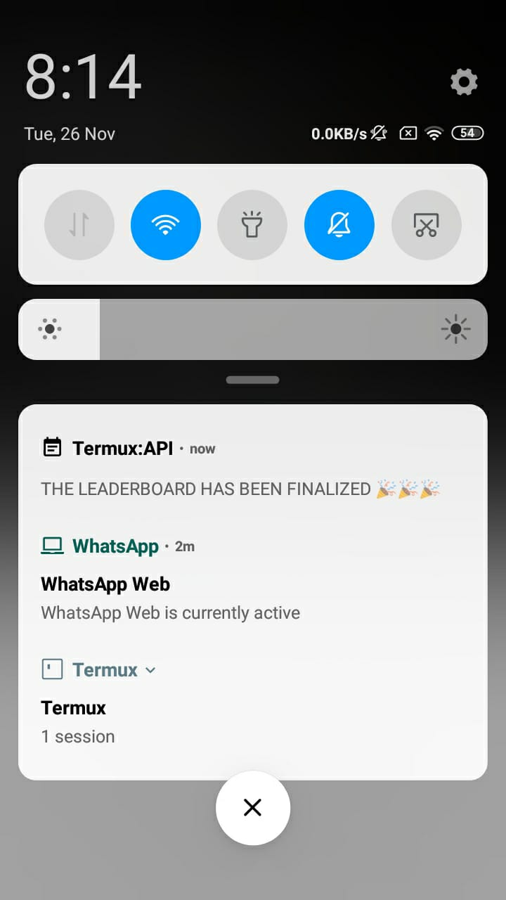
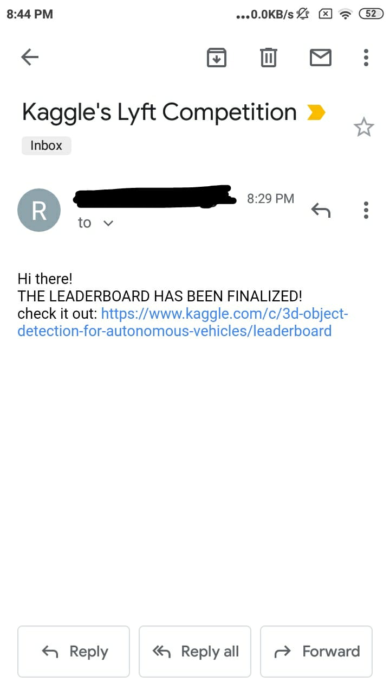

# Final Kaggle LB notification script

A python script to notify us via email and system notification about the finalization of Kaggle Leaderboard of [Lyft 3D object detection competition](https://www.kaggle.com/c/3d-object-detection-for-autonomous-vehicles/). With little modifications the script can be used for any other competition.

## How it works:

I figured out the API which kaggle was using for checking the final status of the Leaderboard. This script uses python's requests module to create a session on Kaggle, and uses the cookies for that session to get response from that API (`get_leaderboard_status` function). Once the script detects that the Leaderboard has been finalized it uses Python's inbuild `stmplib` module to send an email notification to any specified email id using a Gmail account (`send_email` function), it also sends a system wide notification. The script is well commented, open up an issue if you face any problem.

**NOTE**: Tested on Linux. Email sending functionality tested with Gmail only.

For email notifications, please fill your email login credentials in the main function. Activate Gmail's SMTP functionality by enabling 'Less secure apps' within GMAIL, following instructions from [here](https://help.dreamhost.com/hc/en-us/articles/115001719551-Troubleshooting-GMAIL-SMTP-authentication-errors
)

After enabling gmail SMTP functionality, install `requests` with `pip install requests` and then simply run `python kaggle-LB.py`.

## How to get it running on Android:

* Install `Termux` and `Termux:API` apps from play store.
* Install `python` and `termux-api` with `pkg install python` and `pkg install termux-api`.
* Install `requests` with `pip install requests`.
* Get [termux-version.py](termux-version.py) on your phone, open it with Termux, you'll find the file available in termux terminal's `download` directory. Make sure you've added your email credentials in the script and activated Gmail SMTP functionality as mentioned above.
* Run the script with `python termux-version.py`.

## Screenshots

  
  ----
  
  ----
    

